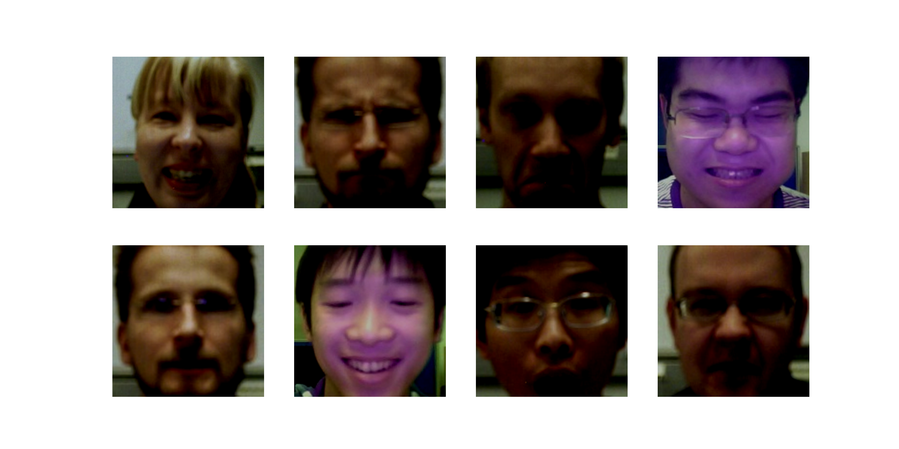

# DALI: Data Load Library 

将数据的预处理放在GPU上, 有机会实现CPU和GPU的延时同步, 更好的利用计算能力, 看起来更适合在训练的时候使用加快速度, 提高显卡的利用率

简单的概括原理就是把数据处理整个移到一个固定的`pipeline`里面, 在这个里面集成好
* 数据提取
* 数据处理
以及数据由几个线程, 几个batch, 每一步都在什么设备上进行

可以代替`Data Loader`和`Data Iterator`


使用DALI加载数据的核心是 ***数据处理的pipeline***, 将不同的操作作为一个图连接起来, 使用的是class`nivida.dali.Pipeline`, 包括预处理的操作有
* 定义
* 创建
* 运行

## 最基本操作

如果考虑最简单的读取和预处理的操作, 可以使用修饰器`pipeine_def`

```python
#!~/opt/anaconda3/envs/pytorch/bin/python
from nvidia.dali import pipeline_def

@pipeline_def
def simple_pipeline():
    ...
```
但是考虑到对修饰器不是很熟悉, 所以不如直接定义从`Pipeline`中继承的类来进行, 只要在类中定义好需要进行的操作, 直接建立`<>.bulid`, 运行`<>.run`就可以

```python
#!~/opt/anaconda3/envs/pytorch/bin/python
from nvidia.dali.Pipeline import Pipeline

class simple_pipeline(Pipeline):
    def __init__(self, batch_size, threads, device_ids):
        super(simple_pipeline, self).__init__(batch_size, threads, device_ids, seed=1234)
        ...

pipe = simple_pipeline(key)
pipe.build() # 建立数据流水线

pip_out = pipe.run() # 运行得到输出, 类似dataLoader拿到了一个batch的输出
```

这样运行得到的返回的输出类型是`TensorListCPU`, 目前所有的数据都在CPU上面, 并且得到的图片没有办法直接读取, 只能通过读取到的图片的`<>.at(<第几张图片>)`来实现

如果要读取, 解码以及对数据进行预处理, 常常使用到的包是`nvidia.dali.fn`或者`nvidia.dali.ops`

* 随机读取某个文件夹里面的图片 `jpegs, labels = fn.readers.file(file_root=image_dir, random_shuffle=True, initial_fill=21)`
  * 如果读取的图片在某个txt下面, 可以设置参数为`file_root`为txt文件的里面写入的图片的根目录, `file_list`为txt文件目录, 两个目录拼起来的地址指向图片的地址, 使用的函数为`ops.FileReader`
* 对图像进行解码`images = fn.decoders.image(jpegs, device='cpu')`
  * 这里的device更推荐选择在GPU和CPU上混合运行, 也即`device=mixed`, 输出的图像自动copy到了GPU上
* 对图像进行旋转` fn.rotate(images, angle=10.0, fill_value=0)`

除了读取需要的函数外, 还需要注意变量读取到的device和argument
* device
  * 可以从CPU到GPU, 不能从GPU到CPU
  * 可以在某一步的输入中explicitly发送到GPU上, 这样得到的结果默认就是在GPU上
  * 如果不进行额外的设定默认和输入的变量位置相关
* arguement
  * 如果定义了某个变量作为参数输入, 这个参数只能放在CPU上, 不能放在GPU上
  * 参与运算的图像输入无所谓, CPU和GPU上都可以

示例见[简单dali调用示例](simple_example.py), 生成的图片为


## 数据读取

如果采用上述提到的方式无法加载数据集, 也可以采用自己构造的方式, 通过自己构建一个 ***迭代类***, 再将其初始化为`Pipeline`类型, 可以进行读取

要求建立的类可以
* 迭代的继续读取文件
* 可以调用内置函数不断向后读取
示例的class的构成如下所示
```python
#!~/opt/anaconda3/envs/pytorch/bin/python
class ExternalIteration(object):
  def __init(self):
  def __iter__(self):
  def __next__(self):
```

### 在CPU上的数据
对于读取本来就在`CPU`上的数据比较简单, 迭代类只需要读取数据的buffer就可以, 不需要将读取的数据根据图像类型进行解码

```python
#!~/opt/anaconda3/envs/pytorch/bin/python
# * 读取简略版
with open(file, 'r') as f:
  files = [line.rstrip() for line in f if line != '']

pic_path = files[i].split(" ")
pic_buffer = open(pic_path, 'rb')
data = np.frombuffer(pic_buffer.read(), dtype = np.float32)
```

之后需要 ***定义Pipeline***, 主要可以分成三步, 分别是
* 定义类, 定义的batch size相等
* 将图片用`fn.external_source`导入, 解码和预处理
* 插入到Pipeline的输出中

### 在GPU上的数据

总体上的步骤不变, 但是迭代器在从文件中获取每一个文件数据的时候必须将其解码为实际的图片, 而不能只读取未解码的数据, 因为函数无法对在GPU上的数据进行解码

读取示例见[data load](dataloader.py), 生成的图片为
cpu

gpu
